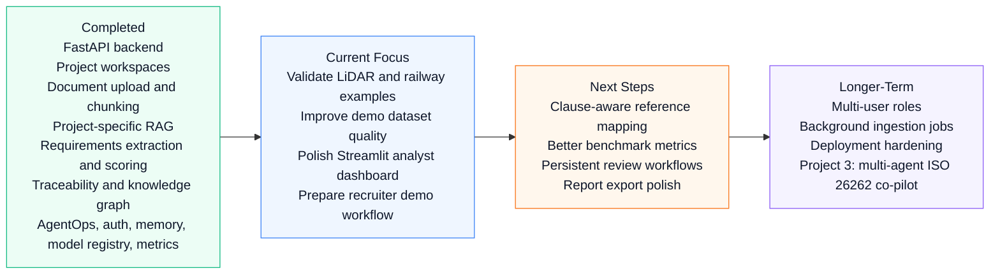
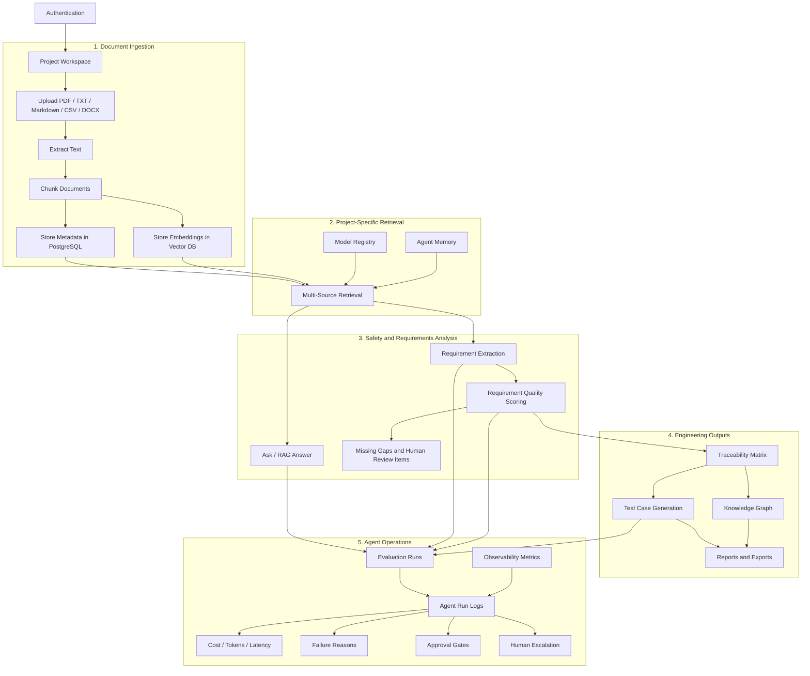
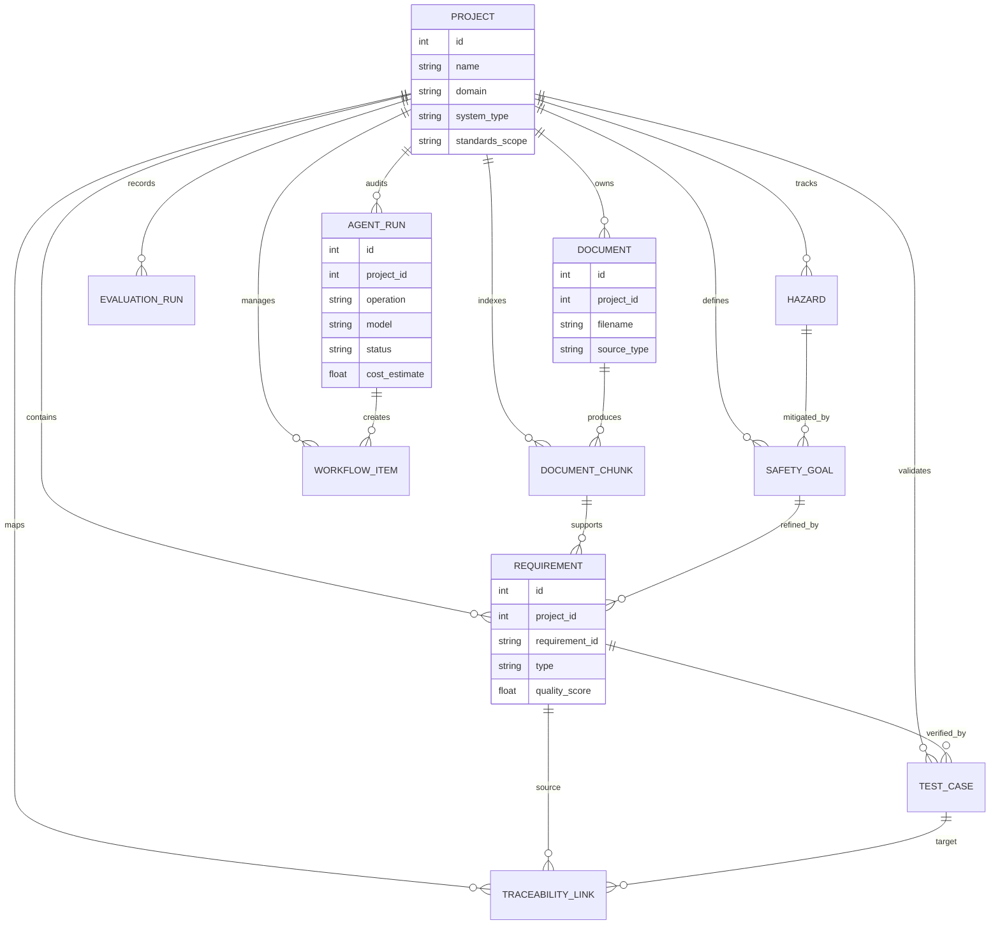
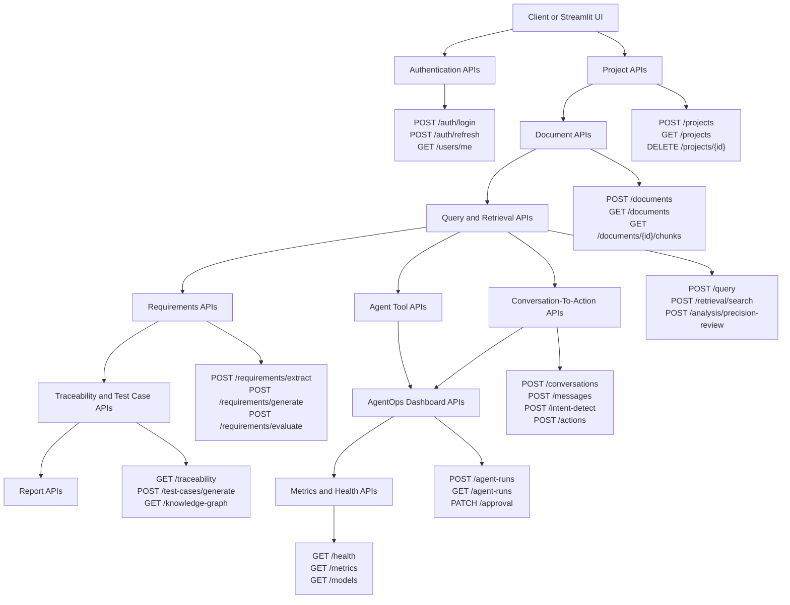
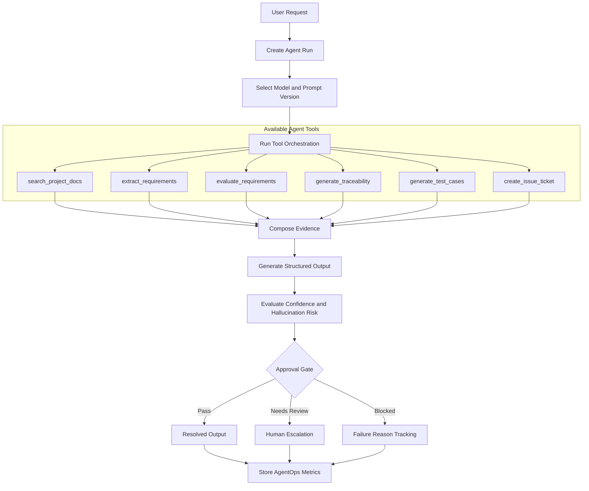
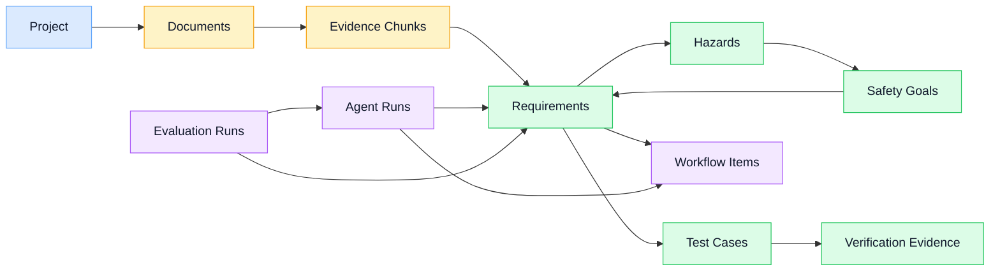
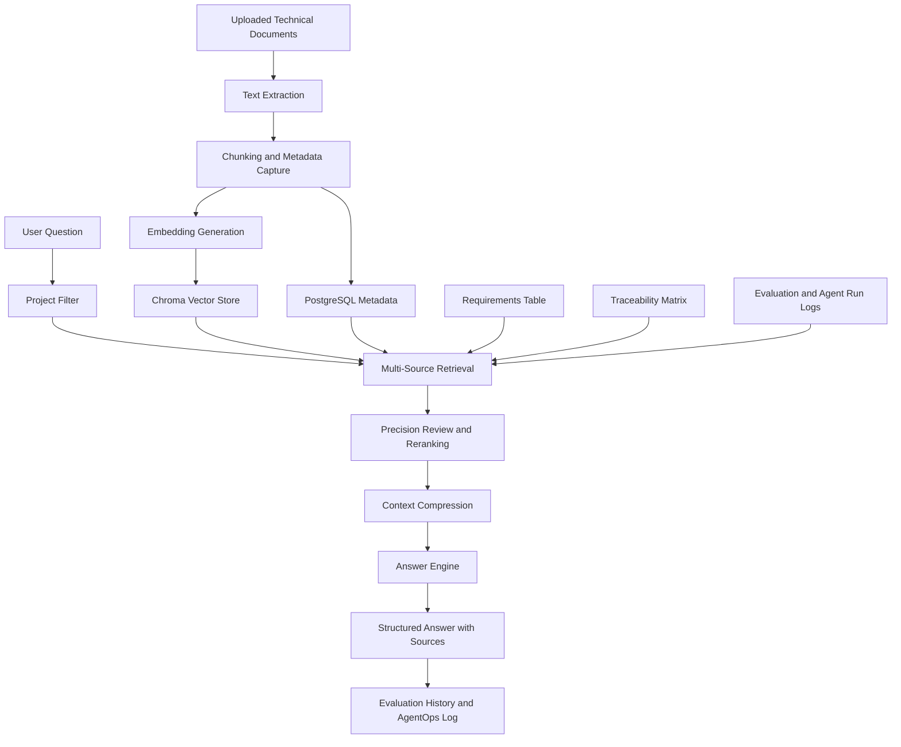
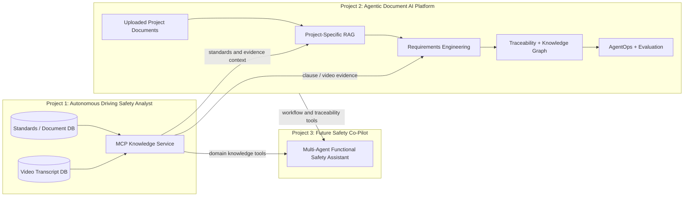

# Agentic Document AI Platform for Safety Engineering

Agentic Document AI platform for safety engineering workflows, requirements
analysis, traceability, and production-grade agent operations.

This project turns safety engineering documents into an agentic backend
platform with FastAPI, project workspaces, PDF upload, project-specific RAG,
structured Pydantic outputs, PostgreSQL, requirements engineering,
traceability, evaluation history, agent operations logging, tool orchestration,
mock external integrations, and Docker Compose.

## Portfolio Description

Productionized the concept into an Agentic Document AI + Requirements
Engineering platform with FastAPI, project workspaces, PDF upload,
project-specific RAG, Pydantic outputs, PostgreSQL, traceability, evaluation
history, tool orchestration, agent run monitoring, approval gates, and Docker
Compose.

## Project Roadmap



## System Architecture



## Database Diagram



## API Documentation

FastAPI exposes interactive Swagger documentation at `/docs`. The main API
surface is organized around project workspaces, document ingestion, retrieval,
requirements engineering, traceability, AgentOps, model selection, memory, and
observability.



## Agent Flow Diagram



## Knowledge Graph Diagram



## RAG Pipeline Diagram



## MCP Integration Concept

Project 2 is designed to consume external safety knowledge services. Project 1
already exposes a read-only MCP server for standards, document, and video
evidence retrieval. Project 2 does not currently run its own MCP server; the
intended integration is for Project 2 or a future Project 3 co-pilot to call
Project 1 as an MCP-based knowledge service.



Planned MCP tool usage:

```text
Project 1 MCP:
  search_safety_standards
  search_video_evidence
  search_combined_safety_context

Project 2 REST APIs:
  requirements extraction
  requirement evaluation
  traceability generation
  workflow item creation
  AgentOps monitoring
```

## What This Project Shows

- FastAPI backend engineering
- API design for project workspaces and document upload
- Project-specific RAG over uploaded safety documents
- Domain profiles for automotive, railway, and generic safety engineering
- Structured Pydantic outputs for safety analysis and requirements engineering
- Requirement extraction, classification, and quality scoring
- Traceability matrix and test-case generation
- Lightweight traceability knowledge graph connecting projects, documents,
  evidence, requirements, hazards, safety goals, test cases, workflow items,
  evaluation runs, and agent runs, with draggable persisted node layouts
- Benchmark readiness metrics for ingestion, requirement quality, traceability
  coverage, evidence coverage, test coverage, and agent reliability
- Evaluation run history for MLOps-style monitoring
- Agent operations module with run logs, cost tracking, failure reasons,
  human escalation flags, approval gates, evaluation scores, and prompt/version
  tracking
- Tool orchestration layer for `search_project_docs`, `extract_requirements`,
  `evaluate_requirements`, `generate_traceability`, `generate_test_cases`, and
  `create_issue_ticket`
- MCP integration concept for consuming Project 1 as an external standards and
  video-evidence knowledge service
- Multi-source retrieval across project documents, requirements, traceability,
  test cases, evaluation history, and agent run logs
- Precision review module with reranked evidence, confidence scoring, candidate
  standard references, compressed context, and human review queue
- Per-run answer engine selection: OpenAI, local Ollama-compatible model, or
  deterministic evidence synthesis with no LLM
- Workflow tracking board for safety-review follow-up actions
- Conversation-to-action workflow that detects user intent from project
  conversations and converts review discussions into workflow items and
  auditable agent runs
- Mock integrations for GitHub issues, Jira-style tickets, CRM-like updates,
  and Slack-style notifications
- Evaluation dashboard metrics for success rate, escalation rate, latency,
  cost, hallucination flags, and quality scores
- PostgreSQL + Chroma architecture
- Docker Compose deployment

## Core Workflow

Create project -> Upload documents -> Extract and chunk text -> Store
project-filtered embeddings -> Ask safety or requirements questions -> Generate
structured analysis -> Extract and evaluate requirements -> Build traceability
matrix and knowledge graph -> Generate test cases -> Export reports.

## Architecture Decks

Two recruiter-facing PowerPoint decks are included under `presentations/`:

```text
presentations/Project_2_Architecture_Agentic_Document_AI_Platform.pptx
presentations/Project_1_Project_2_Interaction_Architecture.pptx
```

They explain the backend architecture of this platform and how it complements
the first Autonomous Driving Safety Analyst project.

## Polished Frontend Handoff

The Streamlit app is the technical analyst dashboard. A Lovable/React frontend
can be added later as a polished product-demo UI while keeping this FastAPI
backend as the system of record.

Use this prompt as the frontend handoff:

```text
docs/lovable_frontend_prompt.md
```

## Demo Dataset

The repository includes a small tracked seed dataset in
`datasets/seed_requirements/`. It contains automotive safety requirements,
hazards, safety goals, traceability examples, and test case links for AEB,
lane keeping, perception monitoring, dataset coverage, and runtime evidence.

This seed dataset is used as the first Requirements Engineering demo source. It
is intentionally small and readable so reviewers can inspect the examples
without downloading large public datasets.

To ingest the seed data into a local demo project:

```bash
python scripts/ingest_seed_requirements.py
```

The script creates or reuses a demo project, stores the seed requirements in
the relational database, and adds the Markdown seed document to the project
vector store for RAG retrieval.

Recommended data strategy:

- use the tracked seed requirements for the first demo and tests
- use uploaded project documents for project-specific RAG
- add public RE datasets such as PURE or Dronology later as benchmark sources
- reuse the first project's safety standards as optional context, not as the
  main requirements label dataset

The repository also includes a converted requirements dataset example under
`converted_dataset/requirements_markdown/`. These files were converted from
public XML requirements documents with:

```bash
python scripts/convert_requirements_xml.py download_dataset --output-dir converted_dataset/requirements_markdown
```

The raw `download_dataset/` folder is intentionally not required for the app.
Use the converted Markdown files for upload demos.

## Railway Safety Demo Framing

This project can be tailored to railway workflows when licensed railway
standards and project documents are available. For public portfolio demos, it
is safer to use railway requirements datasets and public educational context as
review material, not as official compliance evidence.

Recommended wording:

```text
The platform can be tailored to railway safety and cybersecurity standards
when licensed standards documents are available. Public railway RAMS lecture
transcripts are used only as educational context, not official standard text.
```

## Main Endpoints

```text
POST /auth/login
POST /auth/refresh
GET  /users/me
GET  /agent-memory
POST /agent-memory
GET  /models
POST /models/select
GET  /agent-versions
GET  /metrics
GET  /health
GET  /domain-profiles
POST /projects
GET  /projects
GET  /projects/{project_id}
DELETE /projects/{project_id}
POST /projects/{project_id}/documents
GET  /projects/{project_id}/documents
GET  /projects/{project_id}/documents/{document_id}/chunks
POST /projects/{project_id}/query
POST /projects/{project_id}/safety-analysis
POST /projects/{project_id}/requirements/extract
POST /projects/{project_id}/requirements/generate
POST /projects/{project_id}/requirements/generate-from-standards
POST /projects/{project_id}/requirements/evaluate
POST /projects/{project_id}/retrieval/search
POST /projects/{project_id}/analysis/precision-review
GET  /projects/{project_id}/traceability
GET  /projects/{project_id}/knowledge-graph
GET  /projects/{project_id}/knowledge-graph/layout
PUT  /projects/{project_id}/knowledge-graph/layout
GET  /projects/{project_id}/benchmark/evaluate
POST /projects/{project_id}/test-cases/generate
GET  /projects/{project_id}/evaluation-runs
POST /projects/{project_id}/agent-runs
GET  /projects/{project_id}/agent-runs
GET  /projects/{project_id}/agent-runs/{agent_run_id}
PATCH /projects/{project_id}/agent-runs/{agent_run_id}/approval
POST /projects/{project_id}/agent-tools/run
GET  /projects/{project_id}/agent-operations/dashboard
POST /projects/{project_id}/conversations
POST /projects/{project_id}/conversations/{conversation_id}/messages
POST /projects/{project_id}/conversations/{conversation_id}/intent-detect
POST /projects/{project_id}/conversations/{conversation_id}/actions
POST /projects/{project_id}/integrations/github-issue
POST /projects/{project_id}/integrations/jira-ticket
POST /projects/{project_id}/integrations/slack-notification
POST /projects/{project_id}/integrations/mock
GET  /projects/{project_id}/integrations
POST /projects/{project_id}/workflow/items
GET  /projects/{project_id}/workflow/items
PATCH /projects/{project_id}/workflow/items/{item_id}
DELETE /projects/{project_id}/workflow/items/{item_id}
GET  /projects/{project_id}/workflow/dashboard
GET  /projects/{project_id}/report
```

## Agent Operations

The platform stores an operations log for agentic and LLM-backed runs. These
records are separate from the user-facing evaluation history so teams can audit
runtime behavior and governance decisions.

Tracked fields include:

- agent run logs by project and operation
- `agent_run_id`, `project_id`, user request, tools used, retrieved documents,
  model, latency, token usage, cost estimate, status, failure reason, escalation
  status, and created timestamp
- estimated cost per run from token usage
- failure reason and failure stage
- human escalation flag and escalation reason
- approval gate requirement and approval status
- evaluation score per run
- prompt version, model version, prompt template identifier, and tool config
  version
- model used, input summary, output summary, and operational metadata

Approval gates are triggered when confidence is below `0.75`, hallucination risk
is `high` or `critical`, evaluation score is low, or a failure reason is
recorded. Agent outputs can be tracked as `resolved`, `needs_more_info`,
`requires_human_review`, or `blocked`.

## Conversation-To-Action Workflow

The platform can convert project conversations into auditable engineering
actions. A user message is classified into an engineering intent such as
`requirements_action`, `traceability_action`, `verification_action`,
`safety_analysis_action`, or `external_workflow_action`.

The action endpoint can then create:

- an AgentOps run for auditability, confidence, prompt/version, and approval
  tracking
- a workflow item with owner, priority, acceptance criteria, and linked agent
  run metadata

This turns a normal project discussion into a reviewable engineering workflow:

```text
conversation -> intent detection -> proposed action -> workflow item -> human review
```

## Run Locally

```bash
python3.11 -m venv .venv
source .venv/bin/activate
pip install -r requirements.txt
uvicorn backend.main:app --reload --port 8000
```

Open:

```text
http://127.0.0.1:8000/docs
```

If `OPENAI_API_KEY` is set, the backend uses OpenAI embeddings and answer
generation. Without a key, it falls back to deterministic local hash embeddings
and evidence-based draft answers, which keeps tests and demos runnable.

Run the Streamlit frontend in a second terminal:

```bash
streamlit run streamlit_app.py --server.port 8501 --server.address 127.0.0.1
```

Open:

```text
http://127.0.0.1:8501
```

In the **Ask** tab, users can choose the answer engine and model per run:

- OpenAI model, for example `gpt-4o-mini`
- local Ollama-compatible model, for example `qwen2.5:7b-instruct`
- deterministic evidence synthesis, which uses no LLM

## Run With Docker Compose

```bash
cp .env.example .env
docker compose up --build
```

Open:

```text
http://127.0.0.1:8000/docs
```

## Example Query Request

```json
{
  "question": "Are the requirements complete for occluded pedestrian detection at night?",
  "standards": ["ISO 26262", "ISO 21448", "ISO 8800"],
  "include_requirements_review": true,
  "answer_mode": "openai",
  "answer_model": "gpt-4o-mini"
}
```

## Export Formats

```text
GET /projects/{project_id}/traceability?format=csv
GET /projects/{project_id}/report?format=markdown
GET /projects/{project_id}/report?format=requirements_csv
GET /projects/{project_id}/report?format=traceability_csv
GET /projects/{project_id}/report?format=json
```

## Tests

```bash
pytest -q
```
