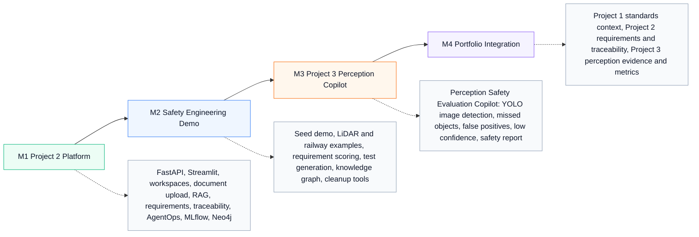
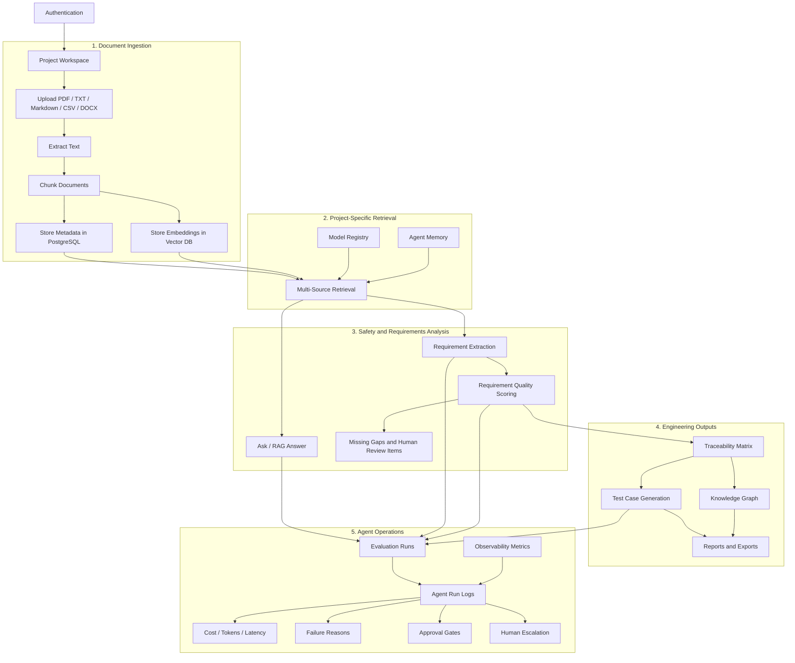
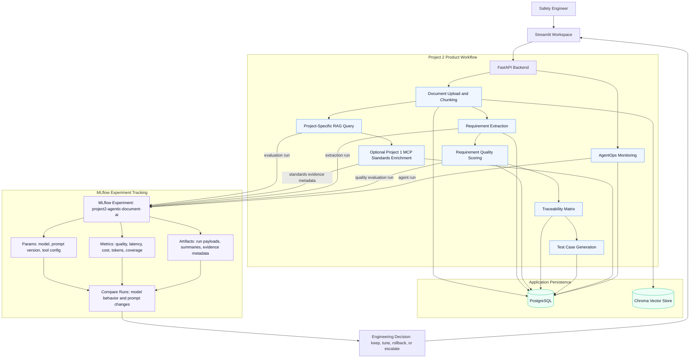
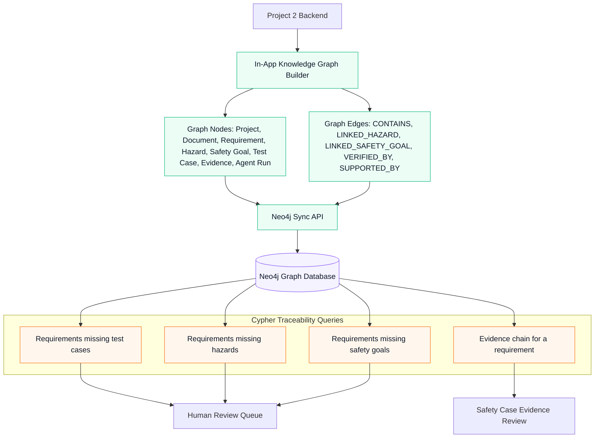
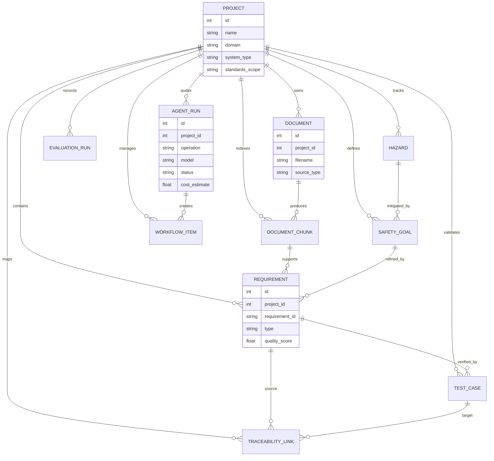
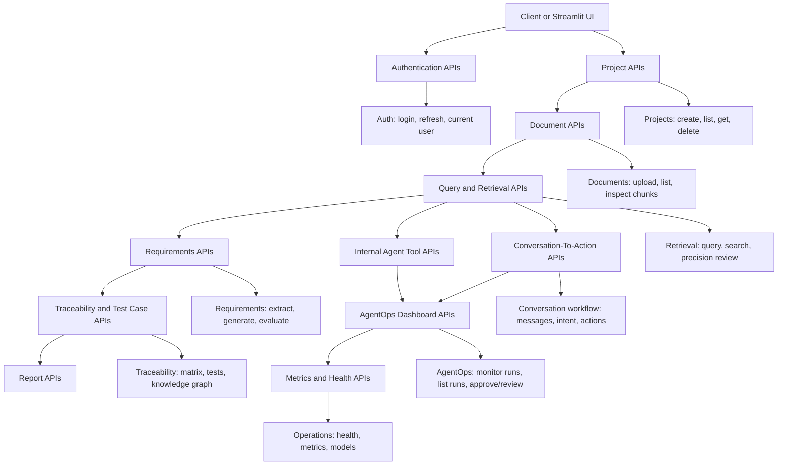
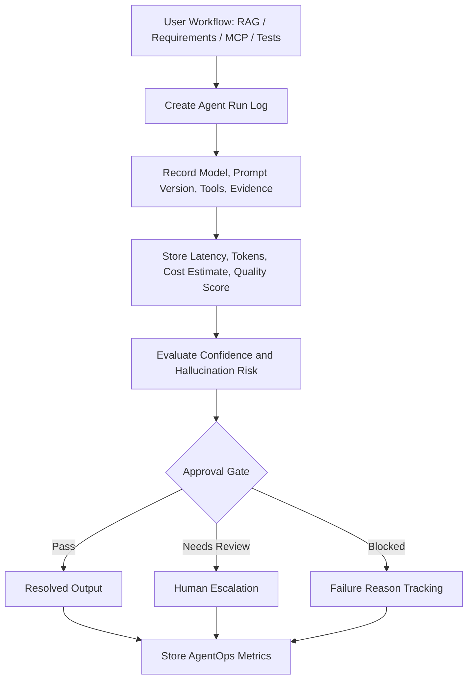
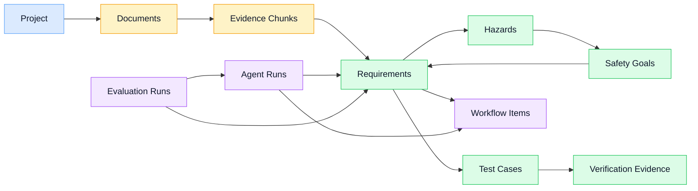
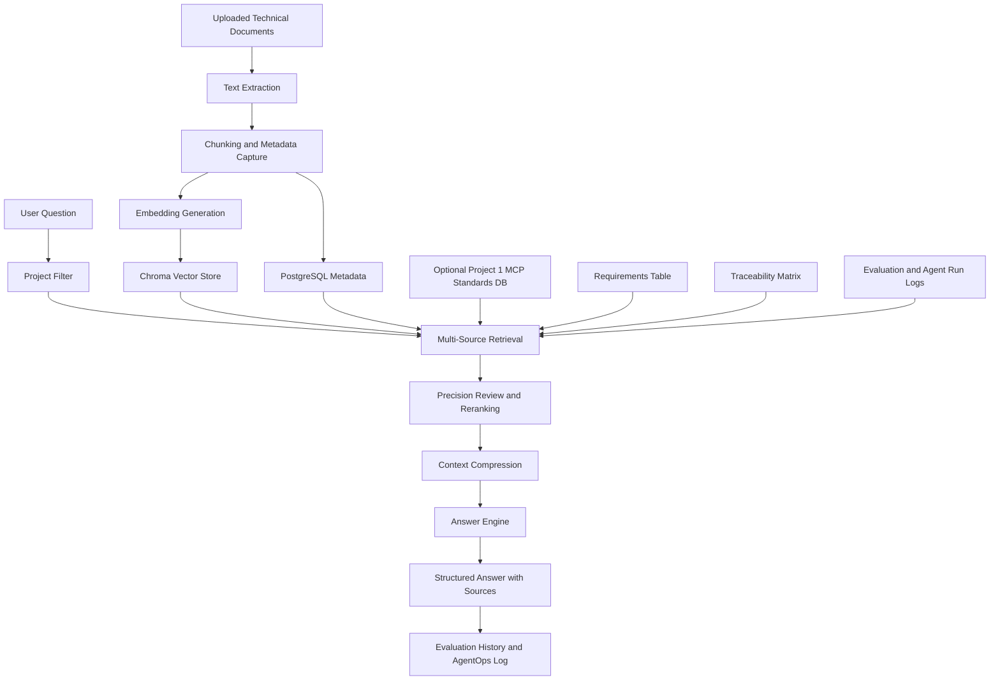
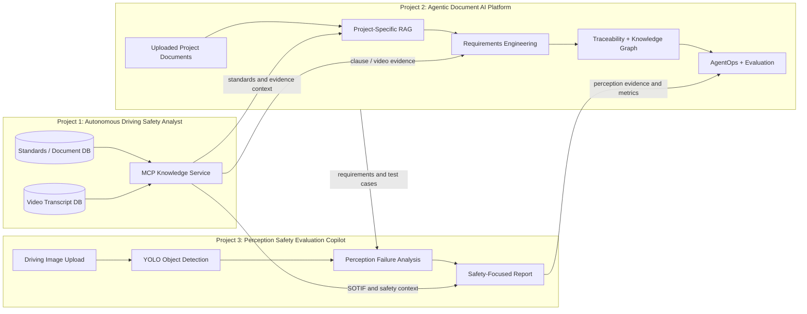

# Agentic Document AI Platform for Safety Engineering

Agentic Document AI platform for safety engineering workflows, requirements
analysis, traceability, and production-grade agent operations.

This project turns safety engineering documents into an agentic backend
platform with FastAPI, project workspaces, PDF upload, project-specific RAG,
structured Pydantic outputs, PostgreSQL, requirements engineering,
traceability, evaluation history, agent operations logging, internal workflow
tooling, mock external integrations, and Docker Compose.

The current Streamlit demo is designed as a recruiter-friendly MVP: users
select a project, upload or replace project documents, ask evidence-grounded
questions, extract and score requirements, build traceability/test outputs, and
monitor AI workflow behavior in AgentOps. GitHub, Jira, and Slack integrations
are mock/local workflow records in this prototype, not live external API calls.

## Portfolio Description

Built an Agentic Document AI + Requirements Engineering MVP with FastAPI,
Streamlit, project workspaces, document upload, project-specific RAG, optional
Project 1 MCP standards enrichment, Pydantic outputs, traceability, evaluation
history, AgentOps monitoring, approval metadata, optional MLflow/Neo4j, and
Docker Compose.

## Project Milestone Roadmap


```mermaid
flowchart LR
    M1["M1 Project 2 Platform"]
    M2["M2 Safety Engineering Demo"]
    M3["M3 Project 3 Perception Copilot"]
    M4["M4 Portfolio Integration"]

    M1 --> M2 --> M3 --> M4

    M1D["FastAPI, Streamlit, workspaces, document upload, RAG, requirements, traceability, AgentOps, MLflow, Neo4j"]
    M2D["Seed demo, LiDAR and railway examples, requirement scoring, test generation, knowledge graph, cleanup tools"]
    M3D["Perception Safety Evaluation Copilot: YOLO image detection, missed objects, false positives, low confidence, safety report"]
    M4D["Project 1 standards context, Project 2 requirements and traceability, Project 3 perception evidence and metrics"]

    M1 -.-> M1D
    M2 -.-> M2D
    M3 -.-> M3D
    M4 -.-> M4D

    classDef milestoneDone fill:#ecfdf5,stroke:#10b981,color:#0f172a;
    classDef milestoneStable fill:#eff6ff,stroke:#3b82f6,color:#0f172a;
    classDef milestoneFocus fill:#fff7ed,stroke:#f97316,color:#0f172a;
    classDef milestoneFuture fill:#f5f3ff,stroke:#8b5cf6,color:#0f172a;
    classDef milestoneDetail fill:#f8fafc,stroke:#94a3b8,color:#0f172a;
    class M1 milestoneDone;
    class M2 milestoneStable;
    class M3 milestoneFocus;
    class M4 milestoneFuture;
    class M1D,M2D,M3D,M4D milestoneDetail;
```

## System Architecture


```mermaid
flowchart TD
    A[Authentication] --> B[Project Workspace]

    subgraph Ingestion["1. Document Ingestion"]
        B --> C[Upload PDF / TXT / Markdown / CSV / DOCX]
        C --> D[Extract Text]
        D --> E[Chunk Documents]
        E --> F[Store Metadata in PostgreSQL]
        E --> G[Store Embeddings in Vector DB]
    end

    subgraph Retrieval["2. Project-Specific Retrieval"]
        F --> H[Multi-Source Retrieval]
        G --> H
        I[Model Registry] --> H
        J[Agent Memory] --> H
    end

    subgraph Analysis["3. Safety and Requirements Analysis"]
        H --> K[Ask / RAG Answer]
        H --> L[Requirement Extraction]
        L --> M[Requirement Quality Scoring]
        M --> N[Missing Gaps and Human Review Items]
    end

    subgraph Traceability["4. Engineering Outputs"]
        M --> O[Traceability Matrix]
        O --> P[Test Case Generation]
        O --> Q[Knowledge Graph]
        P --> R[Reports and Exports]
        Q --> R
    end

    subgraph Operations["5. Agent Operations"]
        K --> S[Evaluation Runs]
        L --> S
        M --> S
        P --> S
        S --> T[Agent Run Logs]
        T --> U[Cost / Tokens / Latency]
        T --> V[Failure Reasons]
        T --> W[Approval Gates]
        T --> X[Human Escalation]
        Y[Observability Metrics] --> T
    end
```

## MLflow MLOps Tracking Flow


```mermaid
flowchart TD
    USER[Safety Engineer] --> UI[Streamlit Workspace]
    UI --> API[FastAPI Backend]

    subgraph ProductFlow["Project 2 Product Workflow"]
        API --> DOC[Document Upload and Chunking]
        DOC --> RAG[Project-Specific RAG Query]
        RAG --> MCPRAG[Optional Project 1 MCP Standards Enrichment]
        DOC --> REQ[Requirement Extraction]
        REQ --> SCORE[Requirement Quality Scoring]
        SCORE --> TRACE[Traceability Matrix]
        TRACE --> TEST[Test Case Generation]
        API --> OPS[AgentOps Monitoring]
    end

    subgraph AppStore["Application Persistence"]
        DB[(PostgreSQL)]
        VDB[(Chroma Vector Store)]
        DOC --> DB
        DOC --> VDB
        REQ --> DB
        SCORE --> DB
        TRACE --> DB
        TEST --> DB
        MCPRAG --> DB
        OPS --> DB
    end

    subgraph MLflow["MLflow Experiment Tracking"]
        EXP[MLflow Experiment: project2-agentic-document-ai]
        PARAMS[Params: model, prompt version, tool config]
        METRICS[Metrics: quality, latency, cost, tokens, coverage]
        ARTIFACTS[Artifacts: run payloads, summaries, evidence metadata]
        COMPARE[Compare Runs: model behavior and prompt changes]
    end

    RAG -->|evaluation run| EXP
    MCPRAG -->|standards evidence metadata| EXP
    REQ -->|extraction run| EXP
    SCORE -->|quality evaluation run| EXP
    OPS -->|agent run| EXP
    EXP --> PARAMS
    EXP --> METRICS
    EXP --> ARTIFACTS
    PARAMS --> COMPARE
    METRICS --> COMPARE
    ARTIFACTS --> COMPARE

    COMPARE --> DECIDE[Engineering Decision: keep, tune, rollback, or escalate]
    DECIDE --> UI

    classDef product fill:#eff6ff,stroke:#3b82f6,color:#0f172a;
    classDef store fill:#ecfdf5,stroke:#10b981,color:#0f172a;
    classDef mlops fill:#f5f3ff,stroke:#8b5cf6,color:#0f172a;
    class DOC,RAG,MCPRAG,REQ,SCORE,TRACE,TEST,OPS product;
    class DB,VDB store;
    class EXP,PARAMS,METRICS,ARTIFACTS,COMPARE mlops;
```

## Neo4j Traceability Graph Flow


```mermaid
flowchart TD
    APP[Project 2 Backend] --> KG[In-App Knowledge Graph Builder]
    KG --> NODES[Graph Nodes: Project, Document, Requirement, Hazard, Safety Goal, Test Case, Evidence, Agent Run]
    KG --> EDGES[Graph Edges: CONTAINS, LINKED_HAZARD, LINKED_SAFETY_GOAL, VERIFIED_BY, SUPPORTED_BY]

    NODES --> SYNC[Neo4j Sync API]
    EDGES --> SYNC
    SYNC --> NEO[(Neo4j Graph Database)]

    subgraph CypherQueries["Cypher Traceability Queries"]
        Q1[Requirements missing test cases]
        Q2[Requirements missing hazards]
        Q3[Requirements missing safety goals]
        Q4[Evidence chain for a requirement]
    end

    NEO --> Q1
    NEO --> Q2
    NEO --> Q3
    NEO --> Q4
    Q1 --> REVIEW[Human Review Queue]
    Q2 --> REVIEW
    Q3 --> REVIEW
    Q4 --> SAFETYCASE[Safety Case Evidence Review]

    classDef graphNode fill:#ecfdf5,stroke:#10b981,color:#0f172a;
    classDef query fill:#fff7ed,stroke:#f97316,color:#0f172a;
    classDef db fill:#f5f3ff,stroke:#8b5cf6,color:#0f172a;
    class KG,NODES,EDGES,SYNC graphNode;
    class Q1,Q2,Q3,Q4 query;
    class NEO db;
```

Neo4j is used as an optional graph database layer for Cypher-based
traceability analysis. RDF/SPARQL is intentionally left as a future semantic
web extension; Project 2 uses Neo4j/Cypher because it maps naturally to
engineering traceability and is easier to demo.

## Database Diagram


```mermaid
erDiagram
    PROJECT ||--o{ DOCUMENT : owns
    PROJECT ||--o{ DOCUMENT_CHUNK : indexes
    PROJECT ||--o{ REQUIREMENT : contains
    PROJECT ||--o{ HAZARD : tracks
    PROJECT ||--o{ SAFETY_GOAL : defines
    PROJECT ||--o{ TEST_CASE : validates
    PROJECT ||--o{ TRACEABILITY_LINK : maps
    PROJECT ||--o{ EVALUATION_RUN : records
    PROJECT ||--o{ AGENT_RUN : audits
    PROJECT ||--o{ WORKFLOW_ITEM : manages
    DOCUMENT ||--o{ DOCUMENT_CHUNK : produces
    DOCUMENT_CHUNK ||--o{ REQUIREMENT : supports
    HAZARD ||--o{ SAFETY_GOAL : mitigated_by
    SAFETY_GOAL ||--o{ REQUIREMENT : refined_by
    REQUIREMENT ||--o{ TEST_CASE : verified_by
    REQUIREMENT ||--o{ TRACEABILITY_LINK : source
    TEST_CASE ||--o{ TRACEABILITY_LINK : target
    AGENT_RUN ||--o{ WORKFLOW_ITEM : creates

    PROJECT {
        int id
        string name
        string domain
        string system_type
        string standards_scope
    }
    DOCUMENT {
        int id
        int project_id
        string filename
        string source_type
    }
    REQUIREMENT {
        int id
        int project_id
        string requirement_id
        string type
        float quality_score
    }
    AGENT_RUN {
        int id
        int project_id
        string operation
        string model
        string status
        float cost_estimate
    }
```

## API Documentation

FastAPI exposes interactive Swagger documentation at `/docs`. The main API
surface is organized around project workspaces, document ingestion, retrieval,
requirements engineering, traceability, AgentOps, model selection, memory, and
observability.


```mermaid
flowchart TD
    A[Client or Streamlit UI] --> B[Authentication APIs]
    A --> C[Project APIs]
    C --> D[Document APIs]
    D --> E[Query and Retrieval APIs]
    E --> F[Requirements APIs]
    F --> G[Traceability and Test Case APIs]
    G --> H[Report APIs]
    E --> I[Internal Agent Tool APIs]
    E --> L[Conversation-To-Action APIs]
    L --> J
    I --> J[AgentOps Dashboard APIs]
    J --> K[Metrics and Health APIs]

    B --> B1["Auth: login, refresh, current user"]
    C --> C1["Projects: create, list, get, delete"]
    D --> D1["Documents: upload, list, inspect chunks"]
    E --> E1["Retrieval: query, search, precision review"]
    F --> F1["Requirements: extract, generate, evaluate"]
    G --> G1["Traceability: matrix, tests, knowledge graph"]
    L --> L1["Conversation workflow: messages, intent, actions"]
    J --> J1["AgentOps: monitor runs, list runs, approve/review"]
    K --> K1["Operations: health, metrics, models"]
```

## Agent Flow Diagram


```mermaid
flowchart TD
    A[User Workflow: RAG / Requirements / MCP / Tests] --> B[Create Agent Run Log]
    B --> C[Record Model, Prompt Version, Tools, Evidence]
    C --> D[Store Latency, Tokens, Cost Estimate, Quality Score]
    D --> G[Evaluate Confidence and Hallucination Risk]
    G --> H{Approval Gate}
    H -->|Pass| I[Resolved Output]
    H -->|Needs Review| J[Human Escalation]
    H -->|Blocked| K[Failure Reason Tracking]
    I --> L[Store AgentOps Metrics]
    J --> L
    K --> L
```

## Knowledge Graph Diagram


```mermaid
flowchart LR
    P[Project] --> D[Documents]
    D --> E[Evidence Chunks]
    E --> R[Requirements]
    R --> H[Hazards]
    H --> SG[Safety Goals]
    SG --> R
    R --> TC[Test Cases]
    TC --> EV[Verification Evidence]
    R --> W[Workflow Items]
    AR[Agent Runs] --> R
    AR --> W
    ER[Evaluation Runs] --> R
    ER --> AR

    classDef project fill:#dbeafe,stroke:#60a5fa,color:#0f172a;
    classDef evidence fill:#fef3c7,stroke:#f59e0b,color:#0f172a;
    classDef safety fill:#dcfce7,stroke:#22c55e,color:#0f172a;
    classDef ops fill:#f3e8ff,stroke:#a855f7,color:#0f172a;
    class P project;
    class D,E evidence;
    class R,H,SG,TC,EV safety;
    class W,AR,ER ops;
```

## RAG Pipeline Diagram


```mermaid
flowchart TD
    A[Uploaded Technical Documents] --> B[Text Extraction]
    B --> C[Chunking and Metadata Capture]
    C --> D[Embedding Generation]
    D --> E[Chroma Vector Store]
    C --> F[PostgreSQL Metadata]

    G[User Question] --> H[Project Filter]
    H --> I[Multi-Source Retrieval]
    E --> I
    F --> I
    MCP[Optional Project 1 MCP Standards DB] --> I
    J[Requirements Table] --> I
    K[Traceability Matrix] --> I
    L[Evaluation and Agent Run Logs] --> I

    I --> M[Precision Review and Reranking]
    M --> N[Context Compression]
    N --> O[Answer Engine]
    O --> P[Structured Answer with Sources]
    P --> Q[Evaluation History and AgentOps Log]
```

## MCP Integration Concept

Project 2 is designed to consume external safety knowledge services. Project 1
already exposes a read-only MCP server for standards, document, and video
evidence retrieval. Project 2 consumes Project 1 through MCP `stdio` as an
external safety knowledge service.


```mermaid
flowchart LR
    subgraph P1["Project 1: Autonomous Driving Safety Analyst"]
        SDB[(Standards / Document DB)]
        VDB[(Video Transcript DB)]
        MCP[MCP Knowledge Service]
        SDB --> MCP
        VDB --> MCP
    end

    subgraph P2["Project 2: Agentic Document AI Platform"]
        DOCS[Uploaded Project Documents]
        RAG[Project-Specific RAG]
        REQ[Requirements Engineering]
        TRACE[Traceability + Knowledge Graph]
        OPS[AgentOps + Evaluation]
        DOCS --> RAG
        RAG --> REQ
        REQ --> TRACE
        TRACE --> OPS
    end

    subgraph P3["Project 3: Perception Safety Evaluation Copilot"]
        IMG[Driving Image Upload]
        DET[YOLO Object Detection]
        FAIL[Perception Failure Analysis]
        REPORT[Safety-Focused Report]
        IMG --> DET
        DET --> FAIL
        FAIL --> REPORT
    end

    MCP -->|standards and evidence context| RAG
    MCP -->|clause / video evidence| REQ
    MCP -->|SOTIF and safety context| REPORT
    P2 -->|requirements and test cases| FAIL
    REPORT -->|perception evidence and metrics| OPS
```

Live MCP tool usage:

```text
Project 1 MCP:
  get_knowledge_base_status
  search_safety_standards
  search_video_evidence
  search_combined_safety_context

Project 2 REST APIs:
  Ask/RAG query with optional Project 1 standards enrichment
  requirements extraction
  standards-backed requirement generation
  requirement evaluation
  traceability generation
  workflow item creation
  AgentOps monitoring
```

## Live Project 1 MCP Integration

Project 2 now connects to the Project 1 `mcp_server.py` over MCP `stdio`.
The FastAPI backend launches the Project 1 MCP process on demand and exposes:

```text
GET  /mcp/project1/status
POST /mcp/project1/search
```

`POST /projects/{project_id}/requirements/generate-from-standards` uses the
Project 1 standards database by default. It retrieves relevant standards
evidence, compares that evidence with the project's stored requirements, and
uses the configured LLM to generate project-specific missing requirement
candidates with clause/page evidence references. If Project 1 or the LLM is
unavailable, the endpoint safely falls back to the existing offline templates.

`POST /projects/{project_id}/query` can also enrich Ask/RAG answers with
Project 1 standards evidence when `use_project1_mcp=true`. The final answer can
therefore combine uploaded Project 2 document chunks with Project 1 standards
chunks. Retrieved sources expose `source_type` values such as:

```text
project_document
project1_mcp_standard
```

The Streamlit Ask/RAG page includes a checkbox named **Enrich answer with
Project 1 standards MCP**. If Project 1 MCP is unavailable, the app falls back
to uploaded project documents only.

Default sibling-project configuration:

```text
PROJECT1_MCP_ENABLED=true
PROJECT1_MCP_PROJECT_DIR=../Autonomous_Driving_Safety_Analyst
PROJECT1_MCP_PYTHON=../Autonomous_Driving_Safety_Analyst/.venv/bin/python
PROJECT1_MCP_SERVER=mcp_server.py
```

## What This Project Shows

- FastAPI backend engineering
- API design for project workspaces and document upload
- Project-specific RAG over uploaded safety documents
- Optional Ask/RAG enrichment with Project 1 MCP standards evidence
- Domain profiles for automotive, railway, and generic safety engineering
- Structured Pydantic outputs for safety analysis and requirements engineering
- Requirement extraction, classification, and quality scoring
- Traceability matrix and test-case generation
- Lightweight traceability knowledge graph connecting projects, documents,
  evidence, requirements, hazards, safety goals, test cases, workflow items,
  evaluation runs, and agent runs, with draggable persisted node layouts
- Benchmark readiness metrics for ingestion, requirement quality, traceability
  coverage, evidence coverage, test coverage, and agent reliability
- Evaluation run history and optional MLflow experiment tracking for
  MLOps-style monitoring
- AgentOps monitoring module with run logs, cost tracking, failure reasons,
  human escalation flags, approval gates, evaluation scores, and prompt/version
  tracking
- Internal tool orchestration API remains available for development/testing,
  while the Streamlit AgentOps page is read-only and recruiter-friendly
- Live MCP integration for consuming Project 1 as an external standards and
  evidence knowledge service
- Multi-source retrieval across project documents, requirements, traceability,
  test cases, evaluation history, and agent run logs
- Precision review module with reranked evidence, confidence scoring, candidate
  standard references, compressed context, and human review queue
- Per-run answer engine selection: OpenAI, local Ollama-compatible model, or
  deterministic evidence synthesis with no LLM
- Workflow tracking board for safety-review follow-up actions
- Conversation-to-action workflow that detects user intent from project
  conversations and converts review discussions into workflow items and
  auditable agent runs
- Mock/local integrations for GitHub issues, Jira-style tickets, CRM-like
  updates, and Slack-style notifications. These demonstrate workflow intent but
  do not send live external API calls in the prototype.
- Evaluation dashboard metrics for success rate, escalation rate, latency,
  cost, hallucination flags, and quality scores
- Optional MLflow tracking server for requirement extraction, RAG query,
  requirement evaluation, and AgentOps runs
- Optional Neo4j graph database sync with Cypher queries for missing test
  cases, missing hazard links, missing safety-goal links, and evidence chains
- PostgreSQL + Chroma architecture
- Docker Compose deployment

## Core Workflow

Create project -> Upload or replace documents -> Extract and chunk text -> Store
project-filtered embeddings -> Ask safety or requirements questions with
optional Project 1 MCP standards evidence -> Generate structured analysis ->
Extract and evaluate requirements -> Build traceability matrix and knowledge
graph -> Generate test cases -> Monitor workflow behavior in AgentOps -> Export
reports.

For clean testing or recruiter demos, the Documents page includes **Replace
existing project documents before upload**. When enabled, the backend removes
old document rows, chunks, uploaded files, and vector-store entries for the
selected project before indexing the new upload. When disabled, uploads are
additive and retrieval searches all documents inside the selected project.

## Architecture Decks

Two recruiter-facing PowerPoint decks are included under `presentations/`:

```text
presentations/Project_2_Architecture_Agentic_Document_AI_Platform.pptx
presentations/Project_1_Project_2_Interaction_Architecture.pptx
```

They explain the backend architecture of this platform and how it complements
the first Autonomous Driving Safety Analyst project.

## Polished Frontend Handoff

The Streamlit app is the technical analyst dashboard. A Lovable/React frontend
can be added later as a polished product-demo UI while keeping this FastAPI
backend as the system of record.

Use this prompt as the frontend handoff:

```text
docs/lovable_frontend_prompt.md
```

## Demo Dataset

The repository includes a small tracked seed dataset in
`datasets/seed_requirements/`. It contains automotive safety requirements,
hazards, safety goals, traceability examples, and test case links for AEB,
lane keeping, perception monitoring, dataset coverage, and runtime evidence.

This seed dataset is used as the first Requirements Engineering demo source. It
is intentionally small and readable so reviewers can inspect the examples
without downloading large public datasets.

To ingest the seed data into a local demo project:

```bash
python scripts/ingest_seed_requirements.py
```

The script creates or reuses a demo project, stores the seed requirements in
the relational database, and adds the Markdown seed document to the project
vector store for RAG retrieval.

Recommended data strategy:

- use the tracked seed requirements for the first demo and tests
- use uploaded project documents for project-specific RAG
- add public RE datasets such as PURE or Dronology later as benchmark sources
- reuse the first project's safety standards as optional context, not as the
  main requirements label dataset

The repository also includes a converted requirements dataset example under
`converted_dataset/requirements_markdown/`. These files were converted from
public XML requirements documents with:

```bash
python scripts/convert_requirements_xml.py download_dataset --output-dir converted_dataset/requirements_markdown
```

The raw `download_dataset/` folder is intentionally not required for the app.
Use the converted Markdown files for upload demos.

## Recommended Recruiter Demo Flow

For a short non-technical demo, use:

```text
datasets/seed_requirements/automotive_safety_requirements.md
```

Suggested flow:

1. Create or select a clean project.
2. Open **Documents** and upload the Markdown file. If reusing a project, enable
   **Replace existing project documents before upload**.
3. Open **Ask / RAG** and ask:

   ```text
   Are the requirements complete for occluded pedestrian detection at night?
   ```

4. Show the answer, missing/weak evidence, and retrieved sources. If Project 1
   MCP is connected, show that evidence can come from both `project_document`
   and `project1_mcp_standard`.
5. Open **Requirements** and extract/evaluate requirements.
6. Open **Traceability** and show how hazards, safety goals, requirements, and
   tests connect.
7. Open **AgentOps** and explain that it monitors workflow reliability, cost,
   latency, quality score, hallucination risk, and human review state.

Recommended framing:

```text
This is a working MVP, not a certified safety tool. It demonstrates how
document-based business processes can be automated with AI while keeping
evidence, review, monitoring, and human-in-the-loop controls visible.
```

## Railway Safety Demo Framing

This project can be tailored to railway workflows when licensed railway
standards and project documents are available. For public portfolio demos, it
is safer to use railway requirements datasets and public educational context as
review material, not as official compliance evidence.

Recommended wording:

```text
The platform can be tailored to railway safety and cybersecurity standards
when licensed standards documents are available. Public railway RAMS lecture
transcripts are used only as educational context, not official standard text.
```

## Main Endpoints

```text
POST /auth/login
POST /auth/refresh
GET  /users/me
GET  /agent-memory
POST /agent-memory
GET  /models
POST /models/select
GET  /agent-versions
GET  /metrics
GET  /mlflow/status
GET  /neo4j/status
GET  /mcp/project1/status
POST /mcp/project1/search
GET  /health
GET  /domain-profiles
POST /projects
GET  /projects
GET  /projects/{project_id}
DELETE /projects/{project_id}
POST /projects/{project_id}/documents
POST /projects/{project_id}/documents?replace_existing=true
GET  /projects/{project_id}/documents
GET  /projects/{project_id}/documents/{document_id}/chunks
POST /projects/{project_id}/query
POST /projects/{project_id}/safety-analysis
POST /projects/{project_id}/requirements/extract
POST /projects/{project_id}/requirements/generate
POST /projects/{project_id}/requirements/generate-from-standards
POST /projects/{project_id}/requirements/evaluate
POST /projects/{project_id}/retrieval/search
POST /projects/{project_id}/analysis/precision-review
GET  /projects/{project_id}/traceability
GET  /projects/{project_id}/knowledge-graph
GET  /projects/{project_id}/knowledge-graph/layout
PUT  /projects/{project_id}/knowledge-graph/layout
POST /projects/{project_id}/neo4j/sync
GET  /projects/{project_id}/neo4j/query
GET  /projects/{project_id}/benchmark/evaluate
POST /projects/{project_id}/test-cases/generate
GET  /projects/{project_id}/evaluation-runs
POST /projects/{project_id}/agent-runs
GET  /projects/{project_id}/agent-runs
GET  /projects/{project_id}/agent-runs/{agent_run_id}
PATCH /projects/{project_id}/agent-runs/{agent_run_id}/approval
POST /projects/{project_id}/agent-tools/run
GET  /projects/{project_id}/agent-operations/dashboard
POST /projects/{project_id}/conversations
POST /projects/{project_id}/conversations/{conversation_id}/messages
POST /projects/{project_id}/conversations/{conversation_id}/intent-detect
POST /projects/{project_id}/conversations/{conversation_id}/actions
POST /projects/{project_id}/integrations/github-issue
POST /projects/{project_id}/integrations/jira-ticket
POST /projects/{project_id}/integrations/slack-notification
POST /projects/{project_id}/integrations/mock
GET  /projects/{project_id}/integrations
POST /projects/{project_id}/workflow/items
GET  /projects/{project_id}/workflow/items
PATCH /projects/{project_id}/workflow/items/{item_id}
DELETE /projects/{project_id}/workflow/items/{item_id}
GET  /projects/{project_id}/workflow/dashboard
GET  /projects/{project_id}/report
```

## Agent Operations

The platform stores an operations log for agentic and LLM-backed runs. These
records are separate from the user-facing evaluation history so teams can audit
runtime behavior and governance decisions.

Tracked fields include:

- agent run logs by project and operation
- `agent_run_id`, `project_id`, user request, tools used, retrieved documents,
  model, latency, token usage, cost estimate, status, failure reason, escalation
  status, and created timestamp
- estimated cost per run from token usage
- failure reason and failure stage
- human escalation flag and escalation reason
- approval gate requirement and approval status
- evaluation score per run
- prompt version, model version, prompt template identifier, and tool config
  version
- model used, input summary, output summary, and operational metadata

Approval gates are triggered when confidence is below `0.75`, hallucination risk
is `high` or `critical`, evaluation score is low, or a failure reason is
recorded. Agent outputs can be tracked as `resolved`, `needs_more_info`,
`requires_human_review`, or `blocked`.

## Conversation-To-Action Workflow

The platform can convert project conversations into auditable engineering
actions. A user message is classified into an engineering intent such as
`requirements_action`, `traceability_action`, `verification_action`,
`safety_analysis_action`, or `external_workflow_action`.

The action endpoint can then create:

- an AgentOps run for auditability, confidence, prompt/version, and approval
  tracking
- a workflow item with owner, priority, acceptance criteria, and linked agent
  run metadata

This turns a normal project discussion into a reviewable engineering workflow:

```text
conversation -> intent detection -> proposed action -> workflow item -> human review
```

## Run Locally

```bash
python3.11 -m venv .venv
source .venv/bin/activate
pip install -r requirements.txt
uvicorn backend.main:app --reload --port 8000
```

Open:

```text
http://127.0.0.1:8000/docs
```

If `OPENAI_API_KEY` is set, the backend uses OpenAI embeddings and answer
generation. Without a key, it falls back to deterministic local hash embeddings
and evidence-based draft answers, which keeps tests and demos runnable.

Run the Streamlit frontend in a second terminal:

```bash
streamlit run streamlit_app.py --server.port 8501 --server.address 127.0.0.1
```

Open:

```text
http://127.0.0.1:8501
```

In the **Ask** tab, users can choose the answer engine and model per run:

- OpenAI model, for example `gpt-4o-mini`
- local Ollama-compatible model, for example `qwen2.5:7b-instruct`
- deterministic evidence synthesis, which uses no LLM
- optional Project 1 MCP standards enrichment when the sibling Project 1 MCP
  server is available

## Run With Docker Compose

```bash
cp .env.example .env
docker compose up --build
```

Open:

```text
http://127.0.0.1:8000/docs
```

MLflow is included in Docker Compose. The backend mirrors evaluation and
AgentOps runs into the `project2-agentic-document-ai` experiment when
`MLFLOW_TRACKING_ENABLED=true`.

```text
MLflow UI: http://127.0.0.1:5000
Tracking URI in Docker: http://mlflow:5000
Local file tracking fallback: ./mlruns
```

Neo4j is also included in Docker Compose for graph database traceability:

```text
Neo4j Browser: http://127.0.0.1:7474
Bolt URI in Docker: bolt://neo4j:7687
Default login: neo4j / safetygraph
```

For a non-Docker run, enable MLflow with:

```bash
export MLFLOW_TRACKING_ENABLED=true
export MLFLOW_TRACKING_URI=./mlruns
export MLFLOW_EXPERIMENT_NAME=project2-agentic-document-ai
```

For a non-Docker Neo4j run, enable graph sync with:

```bash
export NEO4J_ENABLED=true
export NEO4J_URI=bolt://localhost:7687
export NEO4J_USERNAME=neo4j
export NEO4J_PASSWORD=safetygraph
```

## Example Query Request

```json
{
  "question": "Are the requirements complete for occluded pedestrian detection at night?",
  "standards": ["ISO 26262", "ISO 21448", "ISO 8800"],
  "include_requirements_review": true,
  "answer_mode": "openai",
  "answer_model": "gpt-4o-mini",
  "use_project1_mcp": true,
  "project1_mcp_results_per_standard": 2
}
```

## Export Formats

```text
GET /projects/{project_id}/traceability?format=csv
GET /projects/{project_id}/report?format=markdown
GET /projects/{project_id}/report?format=requirements_csv
GET /projects/{project_id}/report?format=traceability_csv
GET /projects/{project_id}/report?format=json
```

## Tests

```bash
pytest -q
```
